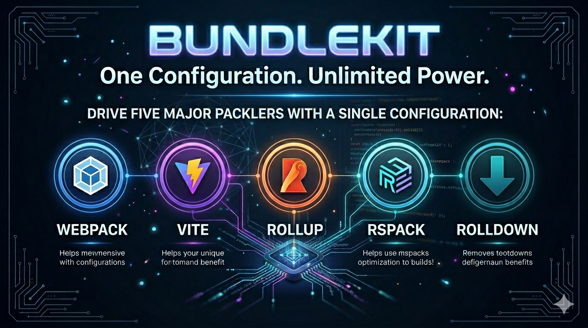

<p align="center">
  
</p>

# bundlekit

[English](#english) | [中文](#chinese)

---

<a name="chinese"></a>

## 中文

前端多打包器构建工具集 —— 一套 `.bundlekitrc.ts` 配置，驱动 Webpack / Vite / Rollup / Rspack / Rolldown / Parcel 六种主流打包器。

### 架构概览

```
.bundlekitrc.ts
    ↓ ConfigLoader 解析
IBuildConfig（抽象配置）
    ↓ Plugin.apply() 注入框架信息（framework 字段）
    ↓ BundlerAdapter.transformConfig()
各打包器原生配置
    ↓ BundlerAdapter.run()
构建产物
```

**核心包说明：**

| 包名 | 说明 |
|------|------|
| `@bundlekit/service` | 核心服务，负责插件加载、配置解析、打包器调度 |
| `@bundlekit/cli` | 脚手架工具，提供 `create` 与 `add` 命令 |
| `@bundlekit/shared-utils` | 公共工具与类型定义 |
| `@bundlekit/bundler-webpack` | Webpack 5 适配器 |
| `@bundlekit/bundler-vite` | Vite 适配器 |
| `@bundlekit/bundler-rollup` | Rollup 4 适配器 |
| `@bundlekit/bundler-rspack` | Rspack 适配器（Rust 实现，极速） |
| `@bundlekit/bundler-rolldown` | Rolldown 适配器（实验性） |
| `@bundlekit/bundler-parcel` | Parcel 2 适配器（零配置） |
| `@bundlekit/plugin-react` | React 构建插件 |
| `@bundlekit/plugin-vue` | Vue 3 构建插件 |
| `@bundlekit/plugin-mock` | Mock API 插件 |
| `@bundlekit/request` | 运行时 HTTP 客户端（axios / fetch 双引擎） |

### 安装

确保 `node >= 18.0.0`，推荐使用 `pnpm`。

#### 方式一：脚手架创建（推荐）

```bash
npx @bundlekit/cli create my-app
```

cli 会引导你选择模板与 bundler，并自动安装 `@bundlekit/service` + 框架插件 + 你选择的 bundler 适配器到新项目。

#### 方式二：现有项目接入

```bash
pnpm add -D @bundlekit/service @bundlekit/plugin-react @bundlekit/bundler-vite
```

或：

```bash
pnpm add -D @bundlekit/cli
dc add react
dc add bundler-vite
```

### 快速开始

```bash
# 创建项目（交互式）
bundlekit-cli create my-app

# 指定模板和打包器
bundlekit-cli create my-app --template react-ts --bundler vite

# 追加插件
bundlekit-cli add mock

# 启动开发服务
npx bundlekit-service serve --bundler vite

# 生产构建
npx bundlekit-service build --bundler webpack --mode production
```

### 运行时切换打包器

无需修改配置，`--bundler` 参数即可切换：

```bash
bundlekit-service serve --bundler rspack    # Rust 实现，冷启动极速
bundlekit-service build --bundler rollup    # 适合库打包
```

### 配置文件示例

```ts
// .bundlekitrc.ts
import type { IBuildConfig } from "@bundlekit/shared-utils";

const config: IBuildConfig = {
  bundler: "vite",
  plugins: ["@bundlekit/plugin-react"],
  config: {
    development: {
      entry: "src/index.tsx",
      output: { dir: "dist", filename: "[name].js", formats: "umd" },
      devServer: { host: "0.0.0.0", port: 3000 },
    },
    production: {
      entry: "src/index.tsx",
      output: { dir: "dist", filename: "[name].[contenthash:8].js", formats: "umd" },
      js: { minify: true },
    },
  },
};

export default config;
```

### Monorepo 构建

```bash
# 构建所有包（按依赖顺序）
pnpm build:service

# 单独构建
pnpm build:shared    # shared-utils
pnpm build:webpack   # bundler-webpack
pnpm build:vite      # bundler-vite
pnpm build:rollup    # bundler-rollup
pnpm build:rspack    # bundler-rspack
pnpm build:parcel    # bundler-parcel
```

### 文档

详细文档请访问 `docs/` 目录或运行本地文档站：

```bash
cd docs
pnpm install && pnpm start
```

---

<a name="english"></a>

## English

A frontend multi-bundler toolkit — one `.bundlekitrc.ts` config drives Webpack / Vite / Rollup / Rspack / Rolldown / Parcel.

### Architecture

```
.bundlekitrc.ts
    ↓ ConfigLoader parses config
IBuildConfig (abstract config)
    ↓ Plugin.apply() injects framework info
    ↓ BundlerAdapter.transformConfig()
Bundler-native config
    ↓ BundlerAdapter.run()
Build output
```

**Packages:**

| Package | Description |
|---------|-------------|
| `@bundlekit/service` | Core service: plugin loading, config resolution, bundler dispatch |
| `@bundlekit/cli` | CLI scaffold with `create` and `add` commands |
| `@bundlekit/shared-utils` | Shared utilities and type definitions |
| `@bundlekit/bundler-webpack` | Webpack 5 adapter |
| `@bundlekit/bundler-vite` | Vite adapter |
| `@bundlekit/bundler-rollup` | Rollup 4 adapter |
| `@bundlekit/bundler-rspack` | Rspack adapter (Rust-based, ultra-fast) |
| `@bundlekit/bundler-rolldown` | Rolldown adapter (experimental) |
| `@bundlekit/bundler-parcel` | Parcel 2 adapter (zero-config) |
| `@bundlekit/plugin-react` | React build plugin |
| `@bundlekit/plugin-vue` | Vue 3 build plugin |
| `@bundlekit/plugin-mock` | Mock API plugin |
| `@bundlekit/request` | Runtime HTTP client (axios / fetch dual engine) |

### Installation

Requires `node >= 18.0.0`. `pnpm` is recommended.

#### Option 1: scaffold (recommended)

```bash
npx @bundlekit/cli create my-app
```

The cli interactively picks a template and bundler, then installs `@bundlekit/service` + framework plugin + the chosen bundler adapter into the new project.

#### Option 2: manual integration

```bash
pnpm add -D @bundlekit/service @bundlekit/plugin-react @bundlekit/bundler-vite
```

### Quick Start

```bash
# Create a project (interactive)
bundlekit-cli create my-app

# Specify template and bundler
bundlekit-cli create my-app --template react-ts --bundler vite

# Add a plugin
bundlekit-cli add mock

# Start dev server
npx bundlekit-service serve --bundler vite

# Production build
npx bundlekit-service build --bundler webpack --mode production
```

### Switch Bundler at Runtime

No config changes needed — just pass `--bundler`:

```bash
bundlekit-service serve --bundler rspack    # Rust-based, ultra-fast cold start
bundlekit-service build --bundler rollup    # Great for library builds
```

### Config Example

```ts
// .bundlekitrc.ts
import type { IBuildConfig } from "@bundlekit/shared-utils";

const config: IBuildConfig = {
  bundler: "vite",
  plugins: ["@bundlekit/plugin-react"],
  config: {
    development: {
      entry: "src/index.tsx",
      output: { dir: "dist", filename: "[name].js", formats: "umd" },
      devServer: { host: "0.0.0.0", port: 3000 },
    },
    production: {
      entry: "src/index.tsx",
      output: { dir: "dist", filename: "[name].[contenthash:8].js", formats: "umd" },
      js: { minify: true },
    },
  },
};

export default config;
```

### Monorepo Build

```bash
# Build all packages (dependency order handled by Turbo)
pnpm build:service

# Build individually
pnpm build:shared    # shared-utils
pnpm build:webpack   # bundler-webpack
pnpm build:vite      # bundler-vite
pnpm build:rollup    # bundler-rollup
pnpm build:rspack    # bundler-rspack
pnpm build:parcel    # bundler-parcel
```

### Documentation

See the `docs/` directory or run the local docs site:

```bash
cd docs
pnpm install && pnpm start
```

### License

MIT
